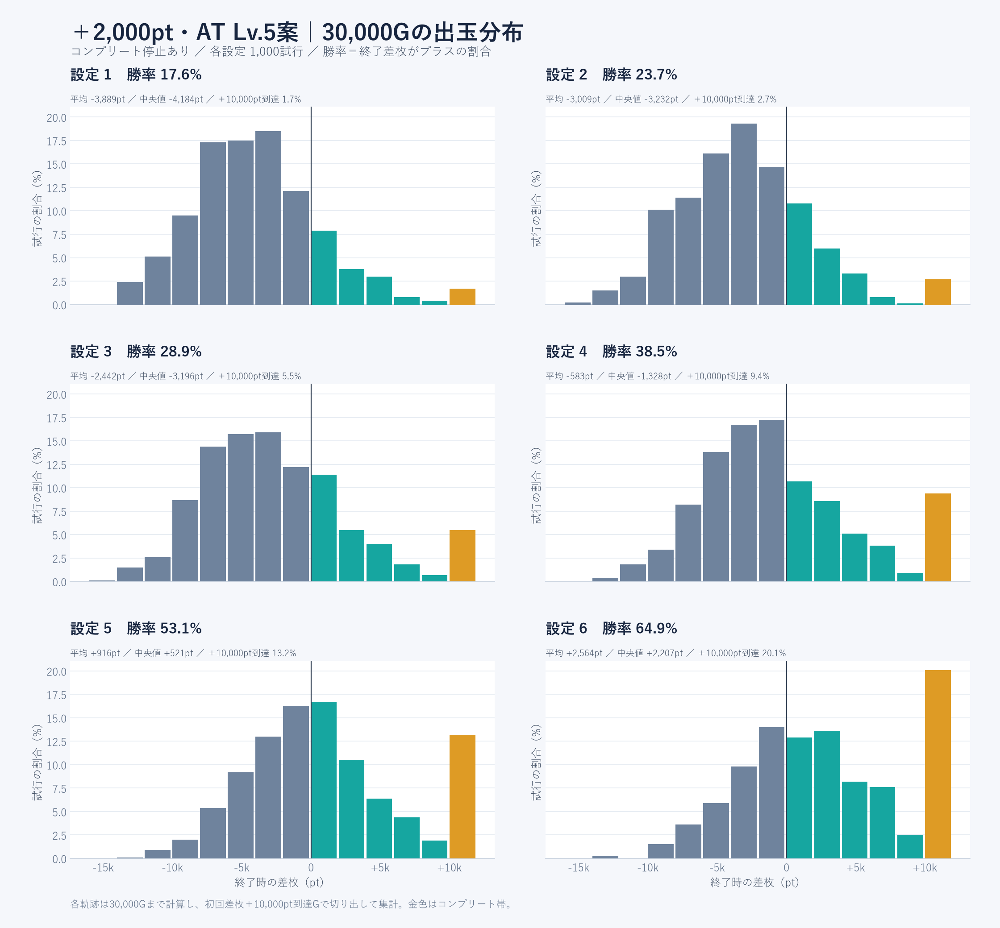
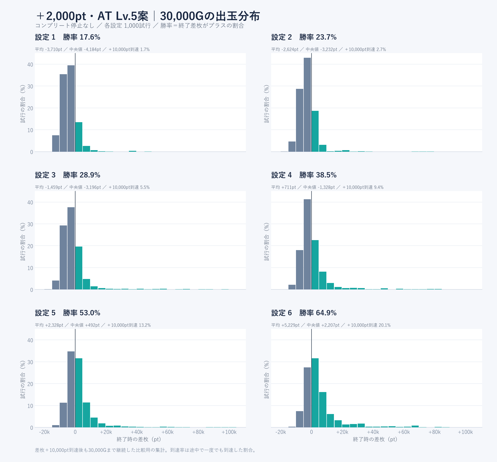

# ＋2,000pt・AT Lv.5案：30,000Gの出玉分布と勝率

成功時の上乗せを8,000ptから2,000ptへ変更。成功後のAT Lv.5は維持し、チャレンジの突入抽選を設定ごとに約1.5〜2.4倍へ増やして機会を分散。初期150pt、3G合計成功50%、1AT1回、通常ATのLv.1〜3、特化の保証は維持する。

先行試算で頻度を単純に4倍にしたところ、設定6の＋10,000pt到達率は36.5%（30,000G×200試行）になったため採用していない。元の到達目標2/4/6/10/15/20%付近を優先し、設定別の頻度を調整した。

## 集計条件

各設定 **30,000G×1,000試行**、計 **180,000,000G**。先行試算とは別の乱数シードで検証。設定2・3は最初の1,000試行で到達率が低かったため頻度を再調整し、さらに別のシードで各1,000試行を実施。他の設定は最初の検証値を採用。

- 出玉分布＝終了時の差枚（実払い出し−実BET）。累計払い出しではない。
- 勝率＝差枚がプラスで終わった試行の割合。±0は勝ちに含めない。
- 本体条件＝初回差枚＋10,000ptでCOMPLETE、未到達なら30,000Gで終了。到達Gの払い出しで最大14ptの超過があり得る。
- 停止なし＝COMPLETE後も30,000Gまで継続する比較用集計。全試行をまず最後まで計算し、本体条件は途中時点で切り出す。
- 到達率＝30,000G以内に一度でも差枚＋10,000ptに達した割合。停止なしの終了差枚が＋10,000pt以上の割合とは異なる。
- 機械割の推定値＝総払い出し÷総実BET。設定変更後からの有限期間推定であり、無限期間の定常値ではない。
- 95%区間は勝率・到達率がWilson区間、機械割が試行単位の比率推定区間。

## コンプリート停止あり（最大30,000G）

|設定|勝率|勝率95%区間|平均差枚|中央値|＋10,000pt到達率|到達率95%区間|機械割推定|
|---|---:|---|---:|---:|---:|---|---:|
|1|17.60%|15.36%〜20.08%|-3,889pt|-4,183pt|1.70%|1.06%〜2.71%|94.11%|
|2|23.70%|21.17%〜26.43%|-3,009pt|-3,231pt|2.70%|1.86%〜3.90%|95.41%|
|3|28.90%|26.18%〜31.79%|-2,442pt|-3,196pt|5.50%|4.25%〜7.09%|96.21%|
|4|38.50%|35.53%〜41.55%|-583pt|-1,328pt|9.40%|7.74%〜11.37%|99.08%|
|5|53.10%|50.00%〜56.18%|+916pt|+521pt|13.20%|11.24%〜15.44%|101.48%|
|6|64.90%|61.89%〜67.80%|+2,564pt|+2,207pt|20.10%|17.73%〜22.70%|104.30%|

設定6の到達率は20.1%で目標の約20%付近。設定2は2.7%で目標の約4%より低く、設定5も13.2%で目標の約15%を下回った。これらを目標達成済みとは扱わない。各設定1,000試行のため標本誤差があり、単一の値に合わせて頻度を再調整し続けてはいない。

## 差枚帯の割合（コンプリート停止あり）

|差枚帯|設定1|設定2|設定3|設定4|設定5|設定6|
|---|---:|---:|---:|---:|---:|---:|
|−10,000pt未満|7.50%|4.70%|4.20%|2.20%|1.00%|0.30%|
|−10,000〜−5,000pt未満|35.40%|28.70%|29.30%|18.00%|11.30%|7.40%|
|−5,000〜0pt未満|39.50%|42.90%|37.60%|41.30%|34.60%|27.40%|
|±0pt|0.00%|0.00%|0.00%|0.00%|0.00%|0.00%|
|0超〜＋5,000pt未満|13.50%|18.50%|19.40%|22.30%|31.60%|31.50%|
|＋5,000〜＋10,000pt未満|2.40%|2.50%|4.00%|6.80%|8.30%|13.30%|
|＋10,000pt以上|1.70%|2.70%|5.50%|9.40%|13.20%|20.10%|

## 停止なし・固定30,000G

|設定|勝率|平均差枚|中央値|5%点|95%点|機械割推定|機械割95%区間|
|---|---:|---:|---:|---:|---:|---:|---|
|1|17.60%|-3,710pt|-4,183pt|-10,800pt|+4,529pt|94.42%|93.91%〜94.92%|
|2|23.70%|-2,624pt|-3,231pt|-9,887pt|+5,013pt|96.04%|95.40%〜96.67%|
|3|28.90%|-1,459pt|-3,196pt|-9,737pt|+8,969pt|97.79%|96.85%〜98.72%|
|4|38.50%|+711pt|-1,328pt|-8,150pt|+13,819pt|101.09%|100.10%〜102.07%|
|5|53.00%|+2,328pt|+492pt|-6,953pt|+15,747pt|103.59%|102.56%〜104.61%|
|6|64.90%|+5,229pt|+2,207pt|-6,101pt|+29,249pt|108.14%|106.90%〜109.38%|

## 旧8,000pt版との比較

旧版も各設定30,000G×1,000試行。本体と同じコンプリート停止で比較。乱数シードが異なるため、値の差には標本誤差も含まれる。

|設定|旧版の到達率|今回の到達率|旧版の機械割推定|今回の機械割推定|
|---|---:|---:|---:|---:|
|1|2.10%|1.70%|93.93%|94.11%|
|2|2.90%|2.70%|95.27%|95.41%|
|3|5.10%|5.50%|96.28%|96.21%|
|4|9.30%|9.40%|99.07%|99.08%|
|5|12.80%|13.20%|101.24%|101.48%|
|6|18.80%|20.10%|103.84%|104.30%|

## 分散させた確率

突入率は「対象小役の成立時の抽選」。以下は強ノヴァ時の値で、弱スイカは0.05倍、強スイカ0.5倍、チャンス目A/B0.2倍、弱ノヴァ0.1倍。通常時・特化中・ルーレット・挑戦後等は抽選対象外。

|設定|旧版|今回|倍率|実測チャレンジ回数|実測成功回数|
|---|---:|---:|---:|---:|---:|
|1|0.060%|0.120%|2.00倍|50|29|
|2|0.115%|0.280%|2.43倍|112|56|
|3|0.165%|0.400%|2.42倍|222|89|
|4|0.270%|0.460%|1.70倍|264|138|
|5|0.360%|0.580%|1.61倍|313|157|
|6|0.520%|0.780%|1.50倍|469|236|

成功率は全設定共通で3G以内50%（毎G約20.63%）。成功した時点の残りptへ2,000を加算する。残り150ptなら2,150ptとなり、以後の払い出しで減る。固定8,000ptを減らした分、その後のLv.5での上乗せ・継続が出玉を左右する。既に付与済みの残りptは更新で減らさない。

## 爆発成功ATの払い出し

以下は測定中に終了まで観測できたATのみの統計。長いATは30,000G時点で未終了になりやすいため、真の平均として扱わない。AT開始前のBIG払い出しは含めない。

|設定|終了を観測|未終了|平均払い出し|中央値|90%点|
|---|---:|---:|---:|---:|---:|
|1|27|2|17,828pt|9,240pt|53,355pt|
|2|46|10|19,121pt|10,023pt|40,704pt|
|3|74|15|23,254pt|13,722pt|58,599pt|
|4|117|21|19,599pt|12,285pt|45,291pt|
|5|117|40|16,184pt|10,569pt|36,624pt|
|6|175|61|18,051pt|12,222pt|39,963pt|

## 検証と再現

- 試算：`node research/burst113/run.mjs batch research/burst113/verify-config.json`
- 設定2・3の最終条件：`node research/burst113/run.mjs batch research/burst113/refine-config.json`
- 分布：`node research/burst113/distribution.mjs final`
- グラフ：`python research/burst113/plot-distribution.py final`
- 本体一致：`node research/burst113/verify-production.mjs final`
- 採用データの対応：`research/burst113/selected-data.json`（設定1・4・5・6はverify、2・3はrefine）。生データは各項目のfile参照。
- 旧版コアは`research/burst113/baseline112/`に保存。試算はそのコアの加算ptと突入確率だけを置換して実行。通常時・ボーナス・特化の抽選は変更していない。

これはゲーム内の出玉設計の試算。前回の日本の型式試験基準との比較で確認した、短期・中期の出玉上限や実機構造の課題を解決したという検証ではない。
