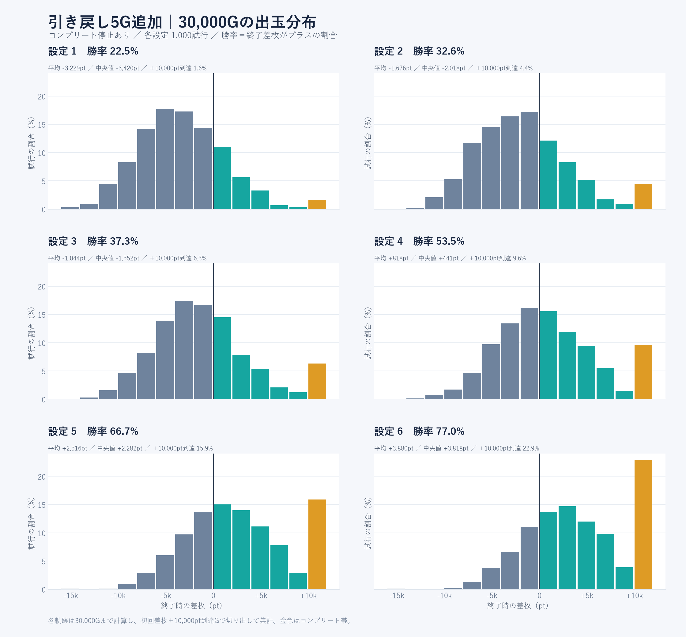

# AT終了時の引き戻し5G：仕様と30,000G試算

最終セットの残りptが0になった第三停止で、そのまま引き戻し5Gへ移行。ATリザルトは5Gすべて非当選だった場合に表示する。セットストック・ボーナスストック・予約済み特化がある場合は、それらの消化を優先する。

## 動作

- 毎BETで特化の対応キャラを1人選び、元の位置のランプを点滅させる。毎G独立に抽選するため、同じキャラが続く場合もある。
- ハズレ・ベル・リプレイ・すべてのレア役で復活抽選。第三停止の図柄停止後、当選時だけ獲得キャラを点灯する。
- 当選時は次のBETで獲得特化ゾーンへ進み、その獲得ptでATを再開。150ptの追加配布は行わない。
- 引き戻しは同じATの続き。ATレベルと爆発チャレンジの使用済み状態を維持し、Lv.5のまま復活できる。
- 強ノヴァ目は復活確定。宗介・とと・うらぴが点滅していた場合はギル・空・逢魔のいずれかへ昇格し、既存の3%裏昇格抽選も適用。すでに上位・裏なら格下げしない。
- スーパーノヴァ目は復活＋裏ギル・裏空・裏逢魔のいずれかを確定。
- 5G非当選で初めて通常へ戻り、AT終了時のモード移行・駆け抜け穢れを1回処理する。AUTOと保存後の再開に対応。

## 役別の復活当選率

小役自体の出現率は通常時の設定別確率を使う。スーパーノヴァ目1/32,768はハズレから振り替える。以下は、その役が成立したゲームでの復活当選率。通常時・AT中の小役確率や特化ゾーンの性能はこの調整では変更していない。

|成立役|設定1|設定2|設定3|設定4|設定5|設定6|
|---|---:|---:|---:|---:|---:|---:|
|ハズレ|0.10%|0.10%|0.10%|0.10%|0.10%|0.10%|
|ベル|1.00%|1.00%|1.00%|1.00%|1.00%|1.00%|
|リプレイ|1.00%|1.00%|1.00%|1.00%|1.00%|1.00%|
|弱スイカ|18.00%|20.00%|22.00%|24.00%|26.00%|26.00%|
|強スイカ|54.00%|60.00%|66.00%|72.00%|78.00%|78.00%|
|チャンス目A|36.00%|40.00%|44.00%|48.00%|52.00%|52.00%|
|チャンス目B|36.00%|40.00%|44.00%|48.00%|52.00%|52.00%|
|弱ノヴァ目|72.00%|80.00%|88.00%|95.00%|95.00%|95.00%|
|強ノヴァ目|100.00%|100.00%|100.00%|100.00%|100.00%|100.00%|
|スーパーノヴァ目|100.00%|100.00%|100.00%|100.00%|100.00%|100.00%|

|設定|5G復活率（理論）|実測|引き戻し開始回数|復活回数|
|---|---:|---:|---:|---:|
|1|7.57%|7.79%|86,034|6,703|
|2|8.34%|8.30%|86,389|7,173|
|3|9.13%|9.10%|85,458|7,780|
|4|9.89%|9.87%|85,839|8,472|
|5|10.41%|10.31%|85,883|8,854|
|6|10.55%|10.41%|85,629|8,917|

実測の引き戻し回数はコンプリート後も30,000Gまで計算した全ゲームから集計。終了時点で5Gを消化しきっていない試行も開始回数に含む。

## 機械割と到達率

各設定30,000G×1,000回、採用データは計1億8,000万G。設定1・5は最初の検証、設定2・3・4は突入率を微調整した後に別の乱数シードで再検証。設定6は到達率が高かったため、突入率と復活当選率を設定5と共通にし、さらに別シードで再検証した。先行調整のデータは含めない。

本体条件は差枚＋10,000pt到達でコンプリート、未到達なら30,000Gで終了。停止なしは比較用に30,000Gまで継続した値。勝率は終了差枚がプラスの割合、到達率は途中で一度でも＋10,000ptに達した割合。払い出しの累計10,000ptとは異なる。95%区間は到達率・勝率がWilson、機械割が試行単位の比率推定。

|設定|機械割・停止あり|機械割95%区間|機械割・停止なし|＋10,000pt到達率|到達率95%区間|目安|勝率|平均差枚|
|---|---:|---|---:|---:|---|---:|---:|---:|
|1|95.10%|94.69%〜95.51%|95.26%|1.60%|0.99%〜2.58%|2.00%|22.50%|-3,229pt|
|2|97.41%|96.96%〜97.86%|98.29%|4.40%|3.29%〜5.86%|4.00%|32.60%|-1,676pt|
|3|98.37%|97.89%〜98.84%|99.28%|6.30%|4.95%〜7.98%|6.00%|37.30%|-1,044pt|
|4|101.31%|100.81%〜101.81%|103.20%|9.60%|7.93%〜11.58%|10.00%|53.50%|+818pt|
|5|104.13%|103.59%〜104.67%|105.68%|15.90%|13.76%〜18.30%|15.00%|66.70%|+2,516pt|
|6|106.58%|106.02%〜107.14%|108.52%|22.90%|20.40%〜25.61%|20.00%|77.00%|+3,880pt|

以前に合意した到達率優先の方針を維持した調整。設定6の機械割114%を達成したという意味ではない。有限期間のゲーム内試算であり、理論上の定常機械割や日本の型式試験への適合を示すものではない。

|終了差枚帯|設定1|設定2|設定3|設定4|設定5|設定6|
|---|---:|---:|---:|---:|---:|---:|
|−10,000pt未満|5.60%|2.30%|1.90%|0.90%|0.20%|0.10%|
|−10,000〜−5,000pt未満|31.30%|23.40%|19.40%|10.40%|6.40%|2.50%|
|−5,000〜0pt未満|40.60%|41.70%|41.40%|35.20%|26.70%|20.40%|
|±0pt|0.00%|0.00%|0.00%|0.00%|0.00%|0.00%|
|0超〜＋5,000pt未満|18.60%|23.80%|25.30%|32.30%|34.50%|34.50%|
|＋5,000〜＋10,000pt未満|2.30%|4.40%|5.70%|11.60%|16.30%|19.60%|
|＋10,000pt以上|1.60%|4.40%|6.30%|9.60%|15.90%|22.90%|

## 爆発チャレンジの頻度調整

引き戻しによる継続分を加えると到達率も上がるため、爆発チャレンジの突入率を次のように調整。成功時の＋2,000pt・Lv.5昇格、3G以内の成功率50%、同一AT中1回、初期150ptは維持した。

下表は強ノヴァ目成立時の抽選率。弱スイカ0.05倍、強スイカ0.5倍、チャンス目A/B0.2倍、弱ノヴァ0.1倍。通常・特化・引き戻し中は爆発チャレンジを別途抽選しない。

|設定|変更前|変更後|実測突入回数|実測成功率|
|---|---:|---:|---:|---:|
|1|0.12%|0.108%|60|40.00%|
|2|0.28%|0.205%|113|48.67%|
|3|0.40%|0.260%|149|45.64%|
|4|0.46%|0.290%|179|52.51%|
|5|0.58%|0.377%|220|54.55%|
|6|0.78%|0.377%|267|47.94%|

## 引き戻し追加前との比較

どちらも各設定30,000G×1,000回。シードが異なるため差には標本誤差を含む。

|設定|追加前・機械割|今回・機械割|追加前・到達率|今回・到達率|
|---|---:|---:|---:|---:|
|1|94.11%|95.10%|1.70%|1.60%|
|2|95.41%|97.41%|2.70%|4.40%|
|3|96.21%|98.37%|5.50%|6.30%|
|4|99.08%|101.31%|9.40%|9.60%|
|5|101.48%|104.13%|13.20%|15.90%|
|6|104.30%|106.58%|20.10%|22.90%|

## 再現と確認

- 現在の本体コアで再計算：`node research/comeback114/run.mjs batch research/comeback114/verify.json`、`node research/comeback114/run.mjs batch research/comeback114/refine.json`。前者は全設定、後者は2・3・4・6の別シード。設定6の採用条件は`node research/comeback114/run.mjs batch research/comeback114/final6.json`。
- 採用データ：`research/comeback114/selected-data.json`。各試行の差枚分布は`docs/comeback114-distribution.json`に保存。
- レポート生成：`node research/comeback114/report.mjs`（引数なし）。グラフ：`python research/comeback114/plot-distribution.py`。
- 本体コアとの軌跡一致：`node research/comeback114/verify-production.mjs`。通常前兆のキャッシュ最適化を無効にした本体コードで、BET・払い出し・引き戻し・AT終了まで照合する。
- `tests/nova-comeback114.test.mjs`で5G終了、全役抽選、最終G復活、強役昇格、保存・ボーナス割り込み、既存ストック優先を検証。
- 実画面で点滅の明暗、第三停止前の非確定、確定後の点灯、保存・再開、AUTOを無音で確認。キャラの元画像は加工せず配置を維持。
